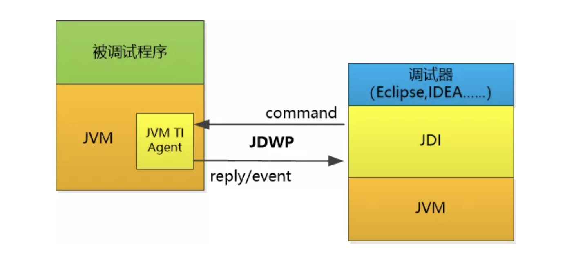

## 架构图
> 

### JVM TI (JVM Tool Interface)
提供以下能力:
- 获取一个线程的状态， 挂起一个线程，让线程恢复执行， 设置一个线程，单步执行
- 获取线程的当前栈帧，调用栈帧，栈帧对应的方法名
- 获取变量的值， 设置变量的值
- 设置断点，清除断点
- 查看类的信息，方法，字段

### JDWP (Java Debug Wire Protocol)
供调试器和 JVM 通信的协议  
- 调试器 可以发送命令给JVM
- JVM 可以处理以后发送响应
- JVM 可以主动向调试器推送事件

### JDI (Java Debug Interface)
实现一个Java版本的接口，让这个接口把 JDWP 和 JVM TI都给封装起来，供我Java IDE来使用集成。  

