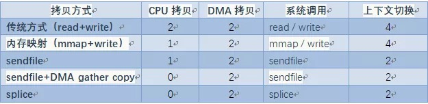
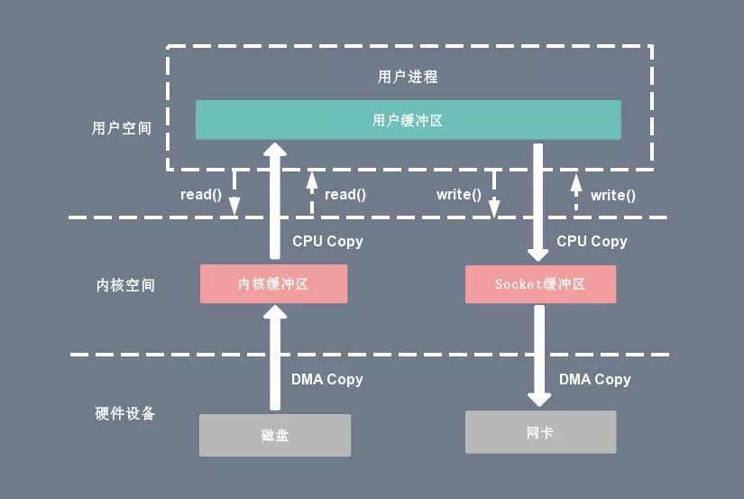
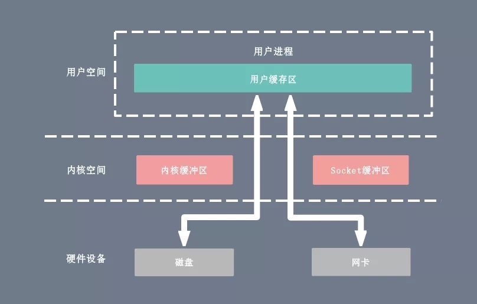
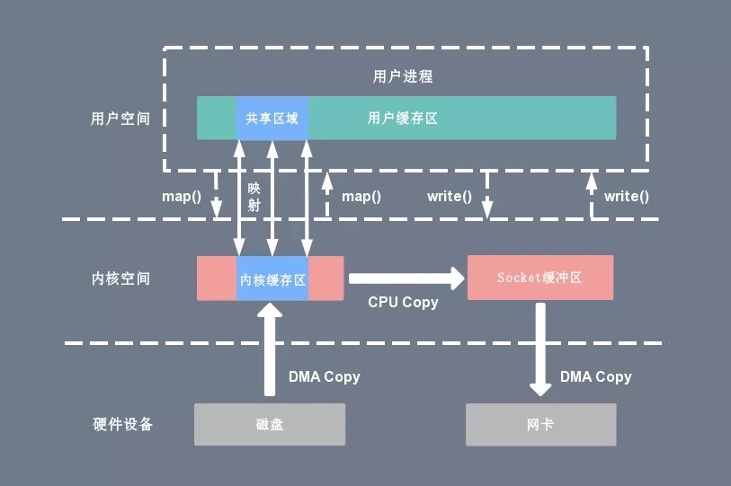
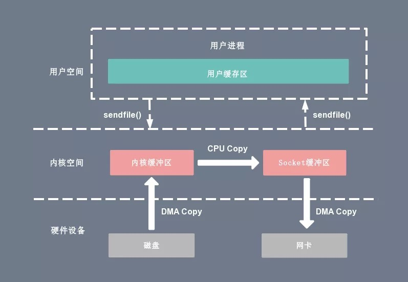
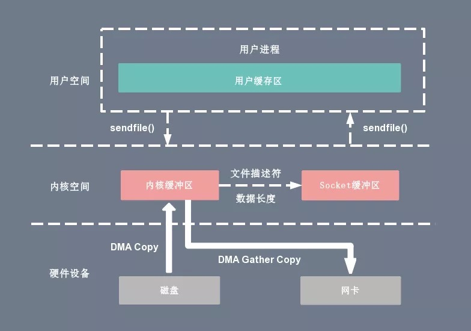
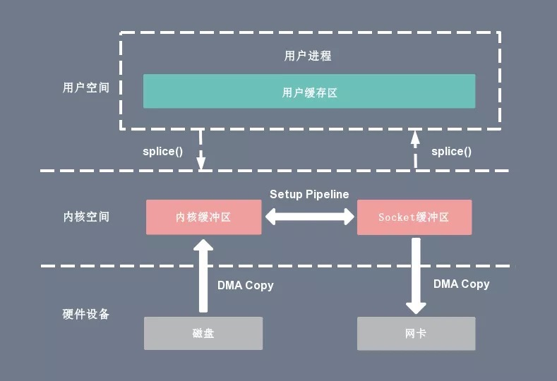

## 概述

零拷贝（Zero-copy）技术指在计算机执行操作时，CPU 不需要先将数据从一个内存区域复制到另一个内存区域，从而可以减少**上下文切换**以及 **CPU 的拷贝时间**。  

它的作用是在数据报从网络设备到用户程序空间传递的过程中，减少数据拷贝次数，减少系统调用，实现 CPU 的零参与，彻底消除 CPU 在这方面的负载。  

实现零拷贝用到的最主要技术是 **DMA 数据传输技术**和**内存区域映射技术**：  

- 零拷贝机制可以减少数据在内核缓冲区和用户进程缓冲区之间反复的 I/O 拷贝操作。
- 零拷贝机制可以减少用户进程地址空间和内核地址空间之间因为上下文切换而带来的 CPU 开销。

## 术语解释

1. **上下文切换：**当用户程序向内核发起系统调用时，CPU 将用户进程从用户态切换到内核态；当系统调用返回时，CPU 将用户进程从内核态切换回用户态。
2. **CPU 拷贝：**由 CPU 直接处理数据的传送，数据拷贝时会一直占用 CPU 的资源。
3. **DMA 拷贝：**由 CPU 向DMA磁盘控制器下达指令，让 DMA 控制器来处理数据的传送，数据传送完毕再把信息反馈给 CPU，从而减轻了 CPU 资源的占有率。

## Linux 零拷贝对比

无论是传统 I/O 拷贝方式还是引入零拷贝的方式，2 次 DMA Copy 是都少不了的，因为两次 DMA 都是依赖硬件完成的。

## 传统 I/O 方式

传统 I/O 操作的数据读写流程，整个过程涉及 2 次 CPU 拷贝、2 次 DMA 拷贝，总共 4 次拷贝，以及 4 次上下文切换。

### 传统读操作

当应用程序执行 read 系统调用读取一块数据的时候，如果这块数据已经存在于用户进程的页内存中，就直接从内存中读取数据。

如果数据不存在，则先将数据从磁盘加载数据到内核空间的读缓存（read buffer）中，再从读缓存拷贝到用户进程的页内存中。

基于传统的 I/O 读取方式，read 系统调用会触发 2 次上下文切换，1 次 DMA 拷贝和 1 次 CPU 拷贝。

1. 用户进程通过 read() 函数向内核（kernel）发起系统调用，上下文从用户态（user space）切换为内核态（kernel space）。
2. CPU 利用 DMA 控制器将数据从主存或硬盘拷贝到内核空间（kernel space）的读缓冲区（read buffer）。
3. CPU 将读缓冲区（read buffer）中的数据拷贝到用户空间（user space）的用户缓冲区（user buffer）。
4. 上下文从内核态（kernel space）切换回用户态（user space），read 调用执行返回。

### 传统写操作

当应用程序准备好数据，执行 write 系统调用发送网络数据时，先将数据从用户空间的页缓存拷贝到内核空间的网络缓冲区（socket buffer）中，然后再将写缓存中的数据拷贝到网卡设备完成数据发送。

基于传统的 I/O 写入方式，write() 系统调用会触发 2 次上下文切换，1 次 CPU 拷贝和 1 次 DMA 拷贝。

1. 用户进程通过 write() 函数向内核（kernel）发起系统调用，上下文从用户态（user space）切换为内核态（kernel space）。
2. CPU 将用户缓冲区（user buffer）中的数据拷贝到内核空间（kernel space）的网络缓冲区（socket buffer）。
3. CPU 利用 DMA 控制器将数据从网络缓冲区（socket buffer）拷贝到网卡进行数据传输。
4. 上下文从内核态（kernel space）切换回用户态（user space），write 系统调用执行返回。

## 零拷贝方式

在 Linux 中零拷贝技术主要有 3 个实现思路：

- **用户态直接 I/O：**应用程序可以直接访问硬件存储，操作系统内核只是辅助数据传输。

  这种方式依旧存在用户空间和内核空间的上下文切换，硬件上的数据直接拷贝至了用户空间，不经过内核空间。因此，直接 I/O 不存在内核空间缓冲区和用户空间缓冲区之间的数据拷贝。

- **减少数据拷贝次数：**在数据传输过程中，避免数据在用户空间缓冲区和系统内核空间缓冲区之间的 CPU 拷贝，以及数据在系统内核空间内的 CPU 拷贝，这也是当前主流零拷贝技术的实现思路。

- **写时复制技术：**写时复制指的是当多个进程共享同一块数据时，如果其中一个进程需要对这份数据进行修改，那么将其拷贝到自己的进程地址空间中，如果只是数据读取操作则不需要进行拷贝操作。

### 用户态直接 I/O

用户态直接 I/O 使得应用进程或运行在用户态（user space）下的库函数直接访问硬件设备。

用户态直接 I/O 只能适用于不需要内核缓冲区处理的应用程序，这些应用程序通常在进程地址空间有自己的数据缓存机制，称为自缓存应用程序，如数据库管理系统就是一个代表。

这种零拷贝机制会直接操作磁盘 I/O，由于 CPU 和磁盘 I/O 之间的执行时间差距，**会造成大量资源的浪费，解决方案是配合异步 I/O 使用。**

### mmap+write

基于 mmap+write 系统调用的零拷贝方式，整个拷贝过程会发生 4 次上下文切换，1 次 CPU 拷贝和 2 次 DMA 拷贝。

一种零拷贝方式是使用 mmap+write 代替原来的 read+write 方式，减少了 1 次 CPU 拷贝操作。mmap 是 Linux 提供的一种内存映射文件方法，即将一个进程的地址空间中的一段虚拟地址映射到磁盘文件地址。

使用 mmap 的目的是将内核中读缓冲区（read buffer）的地址与用户空间的缓冲区（user buffer）进行映射。从而实现内核缓冲区与应用程序内存的共享，**省去了将数据从内核读缓冲区（read buffer）拷贝到用户缓冲区（user buffer）的过程**。然而内核读缓冲区（read buffer）仍需将数据拷贝到内核写缓冲区（socket buffer）。

1. 用户进程通过 mmap() 函数向内核（kernel）发起系统调用，上下文从用户态（user space）切换为内核态（kernel space）。
2. 将用户进程的内核空间的读缓冲区（read buffer）与用户空间的缓存区（user buffer）进行内存地址映射。
3. CPU 利用 DMA 控制器将数据从主存或硬盘拷贝到内核空间（kernel space）的读缓冲区（read buffer）。
4. 上下文从内核态（kernel space）切换回用户态（user space），mmap 系统调用执行返回。
5. 用户进程通过 write() 函数向内核（kernel）发起系统调用，上下文从用户态（user space）切换为内核态（kernel space）。
6. CPU 将读缓冲区（read buffer）中的数据拷贝到网络缓冲区（socket buffer）。
7. CPU 利用 DMA 控制器将数据从网络缓冲区（socket buffer）拷贝到网卡进行数据传输。
8. 上下文从内核态（kernel space）切换回用户态（user space），write 系统调用执行返回。

mmap 主要的用处是提高 I/O 性能，特别是针对大文件。对于小文件，内存映射文件反而会导致碎片空间的浪费。因为内存映射总是要对齐页边界，最小单位是 4 KB，一个 5 KB 的文件将会映射占用 8 KB 内存，也就会浪费 3 KB 内存。

mmap 的拷贝虽然减少了 1 次拷贝，提升了效率，但也存在一些隐藏的问题。当 mmap 一个文件时，如果这个文件被另一个进程所截获，那么 write 系统调用会因为访问非法地址被 SIGBUS 信号终止，SIGBUS 默认会杀死进程并产生一个 coredump，服务器可能因此被终止。

### Sendfile

通过 Sendfile 系统调用，数据可以直接在内核空间内部进行 I/O 传输，从而**省去了数据在用户空间和内核空间之间的来回拷贝。**与 mmap 内存映射方式不同的是， Sendfile 调用中 I/O 数据对用户空间是完全不可见的。也就是说，这是一次完全意义上的数据传输过程。

基于 Sendfile 系统调用的零拷贝方式，整个拷贝过程会发生 2 次上下文切换，1 次 CPU 拷贝和 2 次 DMA 拷贝。

1. 用户进程通过 sendfile() 函数向内核（kernel）发起系统调用，上下文从用户态（user space）切换为内核态（kernel space）。
2. CPU 利用 DMA 控制器将数据从主存或硬盘拷贝到内核空间（kernel space）的读缓冲区（read buffer）。
3. CPU 将读缓冲区（read buffer）中的数据拷贝到的网络缓冲区（socket buffer）。
4. CPU 利用 DMA 控制器将数据从网络缓冲区（socket buffer）拷贝到网卡进行数据传输。
5. 上下文从内核态（kernel space）切换回用户态（user space），Sendfile 系统调用执行返回。

相比较于 mmap 内存映射的方式，Sendfile 少了 2 次上下文切换，但是仍然有 1 次 CPU 拷贝操作。Sendfile 存在的问题是用户程序不能对数据进行修改，而只是单纯地完成了一次数据传输过程。

### Sendfile+DMA gather(聚集归拢) copy

Linux 2.4 版本的内核对 Sendfile 系统调用进行修改，为 DMA 拷贝引入了 gather 操作。

它将内核空间（kernel space）的读缓冲区（read buffer）中对应的数据描述信息（内存地址、地址偏移量）记录到相应的网络缓冲区（ socket buffer）中，由 DMA 根据内存地址、地址偏移量将数据批量地从读缓冲区（read buffer）拷贝到网卡设备中。这样就省去了内核空间中仅剩的 1 次 CPU 拷贝操作。

**在硬件的支持下，Sendfile 拷贝方式不再从内核缓冲区的数据拷贝到 socket 缓冲区，取而代之的仅仅是缓冲区文件描述符和数据长度的拷贝。**这样 DMA 引擎直接利用 gather 操作将页缓存中数据打包发送到网络中即可，本质就是和虚拟内存映射的思路类似。

基于 Sendfile+DMA gather copy 系统调用的零拷贝方式，整个拷贝过程会发生 2 次上下文切换、0 次 CPU 拷贝以及 2 次 DMA 拷贝。

1. 用户进程通过 sendfile() 函数向内核（kernel）发起系统调用，上下文从用户态（user space）切换为内核态（kernel space）。
2. CPU 利用 DMA 控制器将数据从主存或硬盘拷贝到内核空间（kernel space）的读缓冲区（read buffer）。
3. CPU 把读缓冲区（read buffer）的文件描述符（file descriptor）和数据长度拷贝到网络缓冲区（socket buffer）。
4. 基于已拷贝的文件描述符（file descriptor）和数据长度，CPU 利用 DMA 控制器的 gather/scatter 操作直接批量地将数据从内核的读缓冲区（read buffer）拷贝到网卡进行数据传输。
5. 上下文从内核态（kernel space）切换回用户态（user space），Sendfile 系统调用执行返回。

Sendfile+DMA gather copy 拷贝方式同样存在用户程序不能对数据进行修改的问题，而且本身需要硬件的支持，它只适用于将数据**从文件**拷贝**到 socket 套接字**上的传输过程。

### Splice

**Sendfile** 只适用于将数据从文件拷贝到 socket 套接字上，同时**需要硬件的支持**，这也限定了它的使用范围。Linux 在 2.6.17 版本引入 **Splice** 系统调用，不仅**不需要硬件支持**，还实现了两个文件描述符之间的数据零拷贝。

Splice 系统调用可以在内核空间的读缓冲区（read buffer）和网络缓冲区（socket buffer）之间**建立管道**（pipeline），从而避免了两者之间的 CPU 拷贝操作。

基于 Splice 系统调用的零拷贝方式，整个拷贝过程会发生 2 次上下文切换，0 次 CPU 拷贝以及 2 次 DMA 拷贝。和 Sendfile 一样

- 用户进程通过 splice() 函数向内核（kernel）发起系统调用，上下文从用户态（user space）切换为内核态（kernel space）。
- CPU 利用 DMA 控制器将数据从主存或硬盘拷贝到内核空间（kernel space）的读缓冲区（read buffer）。
- CPU 在内核空间的读缓冲区（read buffer）和网络缓冲区（socket buffer）之间建立管道（pipeline）。
- CPU 利用 DMA 控制器将数据从网络缓冲区（socket buffer）拷贝到网卡进行数据传输。
- 上下文从内核态（kernel space）切换回用户态（user space），Splice 系统调用执行返回。

Splice 拷贝方式也同样存在用户程序不能对数据进行修改的问题。除此之外，它使用了 Linux 的管道缓冲机制，可以用于任意两个文件描述符中传输数据，但是它的两个文件描述符参数中有一个必须是管道设备。

