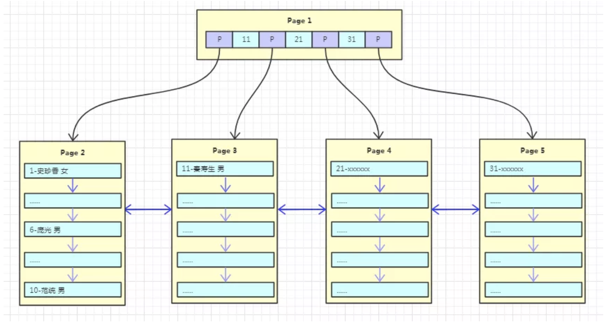
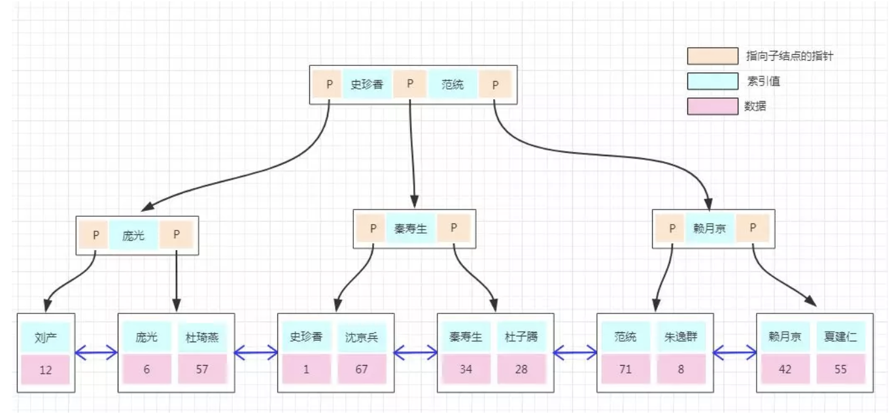
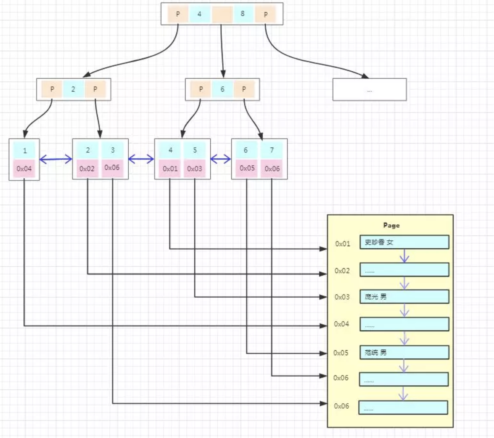

## Explain Type

最为常见的扫描方式且性能由高到低如下：

- system：系统表，少量数据，往往不需要进行磁盘IO；
- const：常量连接；
- eq_ref：主键索引或者非空唯一索引等值扫描；
- ref：非主键非唯一索引等值扫描；
- range：范围扫描；
- index：索引树扫描；
- ALL：全表扫描；

### system

数据已经加载到内存里，不需要进行磁盘IO   

-  从系统表 time_zone 查询数据  


```mysql
explain select * from mysql.time_zone;
```

- 外层嵌套从临时表查询  

```mysql
explain select * from (select * from user where id=1) tmp;
```

### const

主键或者唯一索引上的等值查询  

```mysql
# 查询条件value是1, 并且 ID 为
# 主键|非空唯一索引 时为 const
# 普通索引 时为 ref
explain select * from user where id=1;
```

### eq_ref&ref

eq_ref：主键或者唯一索引上的join查询，对于前表的每一行，后表只有一行被扫描。   

ref：普通索引的join查询，对于前表的每一行，后表可能有多于一行的数据被扫描。   

```mysql
# ID 为
# 主键|非空唯一索引 时为 eq_ref
# 普通索引 时为 ref
# 无索引 时为 all
explain select * from user,user_ex where user.id=user_ex.id;
```

### range

索引上的范围查询  

```mysql
# id 必须是索引
explain select * from user where id between 1 and 4;
explain select * from user where id in(1,2,3);
explain select * from user where id>3;
```

### index

走索引但需扫描索引上的全部数据  

```mysql
# id是主键，count 查询需要通过扫描索引上的全部数据来计数。
explain select count (*) from user;
```

### all

对于前表的每一行，后表都要被全表扫描   

```mysql
explain select * from user,user_ex where user.id=user_ex.id;
```

## Innodb 索引数据结构选择

[数据结构](数据结构.md)  

局部性原理：当一个数据被用到时，其附近的数据也通常会马上被使用。   

操作系统从磁盘读取数据到内存是以磁盘块（Block）为基本单位的，位于同一个磁盘块中的数据会被一次性读取出来。  

- B Tree 中间节点也存有数据，故 B+Tree 内存可以存储的节点数量大于 B Tree，这在查询的时候，B Tree 发生磁盘IO次数是大于 B+Tree 的。  
-  B+Tree 叶子节点之间有指针连接，在范围查询是可以通过链表遍历而无需从上一级父节点查。  

鉴于此，一般关系型数据库中都选择  B+Tree 来存储数据。 

### InnoDB 引擎 若干特点

- InnoDB 存储引擎有页的概念，默认每个页的大小为 16K，每次读取数据时都是读取 4*4K 的大小。  
- 插入数据时，一般是插入到当前行的后面或者是已删除行留下来的空间。并持有指向下一条记录的指针。
-  page1 空间使用完完后会分裂产生两个节点page2和page3，把page1的数据拷贝到page2，新数据插入到page3。原来的page1作为根节点只存放索引key(数据的主键)。
- InnoDB 中根节点是会预读到内存中的，所以结点的物理地址固定会比较好。所以进行分裂的时候选择让page1变成根节点，而不是新建page2为根节点(以page1的数据拷贝到page2为代价)，page1和page3成为page2的叶子节点。
- page1 空间只能存储 10 条数据，在插入第 11 条数据的时候会进行裂变，根据B+Tree 特性，这是一棵 11 阶的树，裂变之后每个结点的元素至少为 11/2=5 个。主键 1-5 的数据还是在原来的页，主键 6-11 的数据会放到新的页，根结点存放主键 6。如果是这样的话，页空间利用率只有 50%，并且会导致更为频繁的页分裂。InnoDB 对聚簇索引做了优化，新的数据放入新创建的页，不移动原有页面的任何记录。  

### InnoDB 引擎 数据查找

- 根据数据的主键在根page中查到相应叶子节点page加载到内存   
- 在page中查找具体的数据   

### 聚集索引

主键聚簇索引叶子节点存有聚簇索引字段和具体数据    



主键自增写入时新插入的数据不会影响到原有页，插入效率高，且页的利用率高。    

但是如果主键是无序的或者随机的，每次的插入可能会导致原有页频繁的分裂，影响插入效率，降低页的利用率。  

如果表**频繁的插入和删除会导致数据页产生碎片**，页的空间利用率低，还会导致树变的“虚高”，降低查询效率，可以通过**索引重建**来消除碎片提高查询效率。  

### 非聚集索引

非聚簇索引的叶子节点只存有非聚簇索引字段和聚簇索引字段.      



索引根据非聚簇索引进行查询是会有**二次查询**和**覆盖索引**的概念   

> 使用 MyISAM 引擎时则没有二次查询的问题，索引树的叶子结点的数据区域没有存放实际的数据，存放的是数据记录的地址。数据的存储不是按主键顺序存放的，是按写入的顺序存放。所以找到节点后直接通过数据的地址就能找到数据，比 InnoDB 的搜索效率高。但 MyISAM 的索引不支持事务，所以用的不多。   
>
> 

## 锁相关

### 查看锁情况

加锁情况 information_schema.innodb_locks(5.7)&performance_schema.data_locks(8.0) 
5.7，通过 information_schema.innodb_locks 查看事务的锁情况，但只能看到阻塞事务的锁；如果事务并未被阻塞，则在该表中看不到该事务的锁情况。 
8.0，删除了 information_schema.innodb_locks，添加了 performance_schema.data_locks，不但可以看到阻塞该事务的锁，还可以看到该事务所持有的锁。  

### 锁的模式

读意向锁，写意向锁，读锁，写锁，自增锁(auto_inc)。

- 读锁-行锁或表锁：共享锁（Share locks，简称 S 锁），加了读锁的记录，所有的事务都可以读取但是不能修改，并且可同时有多个事务对记录加读锁。

- 写锁-行锁或表锁：排他锁（Exclusive locks，简称 X 锁），对记录加了排他锁之后，只有拥有该锁的事务可以读取和修改，其他事务都**不可以读取和修改**，并且同一时间只能有一个事务加写锁。

- 读写意向锁-表锁：由于表锁和行锁锁定范围不同，但是会相互冲突。当要加表锁时，势必要先遍历该表的所有记录，判断是否加有排他锁。这种遍历检查的方式显然是一种低效的方式，MySQL 引入了意向锁，来检测表锁和行锁的冲突。**当事务要在记录上加上读锁或写锁时，要首先在表上加上意向锁。**这样判断表中是否有记录加锁只要看下表上是否有意向锁就行。意向锁之间是不会产生冲突的，也不和 AUTO_INC 表锁冲突，**它只会阻塞表级读锁或表级写锁**，意向锁也不会和行锁冲突，行锁只会和行锁冲突。
- 自增锁-表锁：当插入表中有自增列时，数据库需要自动生成自增值，它会先为该表加 AUTOINC 表锁，阻塞其他事务的插入操作，这样保证生成的自增值肯定是唯一的。AUTO_INC 锁互不兼容，也就是说同一张表同时只允许有一个自增锁；自增值一旦分配了就会 +1，如果事务回滚，自增值也不会减回去，所以自增值可能会出现中断的情况。AUTOINC 表锁会导致并发插入的效率降低，为了提高插入的并发性，MySQL 从 5.1.22 版本开始，引入了一种可选的轻量级锁（mutex）机制来代替 AUTOINC 锁，可以通过参数 innodbautoinclockmode 来灵活控制分配自增值时的并发策略。

### 表锁算法

表锁： MySQL Server 实现，对一整张表加锁，一般是 DDL 处理时使用。

加锁：在会话开始的地方使用 lock 命令将后续需要用到的表都加上锁，在表释放前，**只能访问这些加锁的表**，不能访问其他表，直到释放锁。

释放锁：

- 通过 unlock tables 释放所有表锁。
- 会话持有其他表锁时执行lock table 语句会释放会话之前持有的锁
- 会话持有其他表锁时执行 start transaction 或者 begin 开启事务时，也会释放之前持有的锁。

### 行锁算法

行锁：存储引擎实现，锁定某一行或者某几行，或者行与行之间的间隙。(InnoDB支持行锁)

- Next-Key 锁：所属记录和记录之前的间隙。
   - (-∞,15]，(15,18]，(18,20]，(50,+∞) 通常我们都用这种左开右闭区间来表示 Next-key 锁，圆括号表示不包含该记录，方括号表示包含该记录。
   - 前面四个都是 Next-key 锁，最后一个为间隙锁。**和间隙锁一样，在 RC 隔离级别下没有 Next-key 锁，只有 RR 隔离级别才有。**
- 间隙锁 Gap Lock ：锁住记录和记录之间的间隔。
   - 间隙锁是一种加在两个索引之间的锁，或者加在第一个索引之前，或最后一个索引之后的间隙。
   - 这个间隙可以跨一个索引记录，多个索引记录，甚至是空的。
   - 使用间隙锁可以防止其他事务在这个范围内插入或修改记录，保证两次读取这个范围内的记录不会变，从而不会出现幻读现象。
   - 间隙锁和间隙锁之间是互不冲突的，**间隙锁唯一的作用就是为了防止其他事务的插入**，所以加间隙 S 锁和加间隙 X 锁没有任何区别。
- 记录锁 Record Lock ：只锁住对应的记录。
 - 当sql用到 主键索引或者唯一索引，在主键索引上加记录锁。
 - 当sql用到 二级索引，在二级索引，主键索引上加记录锁。
 - 当sql没用到索引，会进行全表扫描，MySQL 会给整张表的所有数据行加记录锁，再由 MySQL Server 层进行过滤。在 MySQL Server 层进行过滤的时候，**如果发现不满足 WHERE 条件，会释放对应记录的锁。**保证了最后只会持有满足条件记录上的锁，但是每条记录的加锁操作还是不能省略的。
- 插入意向锁：一种特殊的间隙锁表示插入的意向。
   - 只有在 INSERT 的时候才会有这个锁。
   - 插入意向锁和插入意向锁之间互不冲突，可以在同一个间隙中有多个事务同时插入不同索引的记录。
   - 譬如 id = 30 和 id = 49 之间如果有两个事务要同时分别插入 id = 32 和 id = 33 是没问题的，两个事务都会在 id = 30 和 id = 49 之间加上插入意向锁，但是不会冲突。
   - **插入意向锁只会和间隙锁或 Next-key 锁冲突。间隙锁唯一的作用就是防止其他事务插入记录造成幻读，正是由于在执行 INSERT 语句时需要加插入意向锁，而插入意向锁和间隙锁，next-key锁 冲突，从而阻止了插入操作的执行。**


#### read committed

使用记录锁算法，详细见上。

#### repeatable read

当 sql 使用 主键索引或者唯一索引时会使用记录锁算法。

否则使用的是 Next-Key Lock。


## 物化特性仅仅针对查询语句

```sql
-- MySQL5.6 引入了 Materialization 物化特性 
-- 用于子查询（比如在IN/NOT IN子查询以及 FROM 子查询）优化。 
-- 具体实现方式是：在SQL执行过程中，第一次需要子查询结果时执行子查询并将子查询的结果保存为临时表 ，后续对子查询结果集的访问将直接通过临时表获得。
-- 物化子查询优化SQL执行的关键点在于对子查询只需要执行一次。
-- 与之相对的执行方式是对外表的每一行都对子查询进行调用，其执行计划中的查询类型为“DEPENDENT SUBQUERY”。
-- 需要特别注意它目前仅仅针对查询语句的优化。
-- 1. 对待EXISTS子句时，仍然采用嵌套子查询的执行方式。
-- 2. 对于更新或删除需要手工重写成JOIN。

-- 子查询 -> join 
-- 子查询
update operation o
set status = 'applying'
where o.id in (select id
               from (select o.id, o.status
                     from operation o
                     where o.group = 123
                       and o.status not in ('done')
                     order by o.parent,
                              o.id
                     limit 1) t); 
-- join           
update operation o
join (select o.id, o.status
      from operation o
      where o.group = 123
        and o.status not in ('done')
      order by o.parent,
               o.id
      limit 1) t
on o.id = t.id
set status = 'applying';

-- exists -> join
-- exists
SELECT *
FROM my_neighbor n
       LEFT JOIN my_neighbor_apply sra ON n.id = sra.neighbor_id
                                            AND sra.user_id = 'xxx'
WHERE n.topic_status < 4
  AND EXISTS(SELECT 1 FROM message_info m WHERE n.id = m.neighbor_id
                                            AND m.user = 'xxx')
  AND n.topic_type <> 5 ;
-- join 
SELECT *
FROM my_neighbor n
       INNER JOIN message_info m ON n.id = m.neighbor_id
                                      AND m.user = 'xxx'
       LEFT JOIN my_neighbor_apply sra ON n.id = sra.neighbor_id
                                            AND sra.user_id = 'xxx'
WHERE n.topic_status < 4
  AND n.topic_type <> 5 ;
```


