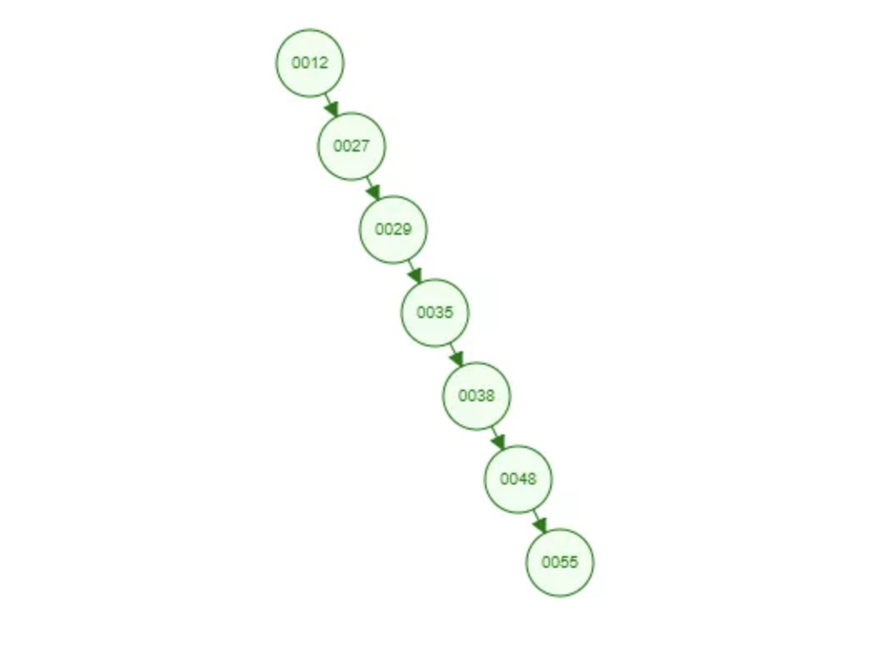
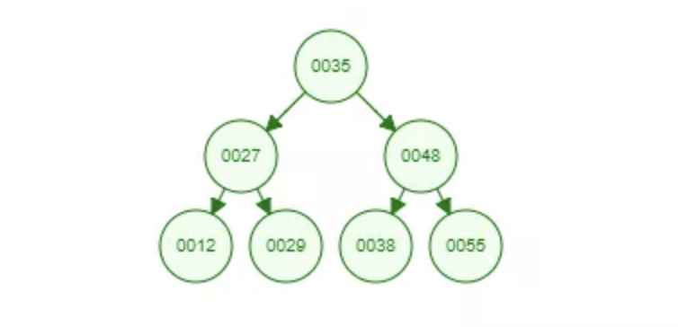

## 二叉树

- 每个结点都包含一个元素以及 n 个子树，这里 0≤n≤2。   
- 左子树和右子树是有顺序的，次序不能任意颠倒。左子树的值要小于父结点，右子树的值要大于父结点。  

新插入的数据总是比已存在的结点数据都要大，每次都会往结点的右边插入，最终导致这棵树会退化为一个线性链表了，这样查找效率自然就低了 。

  

## 平衡二叉树

- 满足二叉树的特性  
- 它的左右两个子树的高度差的绝对值不超过 1，并且左右两个子树都是一棵平衡二叉树  

一棵平衡二叉树能容纳多少的结点跟树的高度是有关系的，假设树的高度为 h，那每一层最多容纳的结点数量为 2^(n-1)，整棵树最多容纳节点数为 2^0+2^1+2^2+...+2^(h-1)。   

100w 数据树的高度大概在 20 左右，也就是说从有着 100w 条数据的平衡二叉树中找一个数据，最坏的情况下需要 20 次查找。  

数据库中的数据基本都是放在磁盘中的，每读取一个二叉树的结点就是一次磁盘 IO，找一条数据如果要经过 20 次磁盘的 IO 效率还是比较低的。  

## B Tree

- 每个结点最多 m 个子结点。 
- 除了根结点和叶子结点外，每个结点最少有 m/2（向上取整）个子结点。 
- 如果根结点不是叶子结点，那根结点至少包含两个子结点。 
- 所有的叶子结点都位于同一层。 
- 每个结点都包含 k 个元素（关键字），这里 m/2≤k。
- 每个节点中的元素（关键字）从小到大排列。 
- 每个元素（关键字）字左结点的值，都小于或等于该元素（关键字）。右结点的值都大于或等于该元素（关键字）。

因为每一层可以容纳更多的节点，树的高度会更短。  

查询所经过的节点数量要比平衡二叉树少很多，意味着要少很多次的磁盘 IO，对性能的提升是很大的。     

叶子节点不包括中间节点，所以是所有节点都需要保持数据的主键和具体数据，这会导致每一个节点占的内存偏大。  

## B+Tree

- 满足 B Tree 的特性
- 所有的非叶子节点只存储数据的主键。 
- 所有（具体数据）都存在叶子结点中。 
- 所有的叶子结点中包含了全部元素的信息。 
- 所有叶子节点之间都有一个链指针。

### 